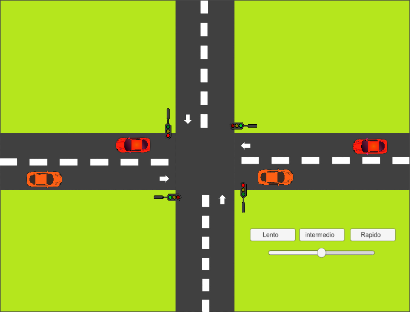

# Traffic simulation using threading
## Definition of threading
*Threads* in the scope of computer programming are a small set of instructions designed to be scheduled and executed by the CPU independently, traditional programs perform under one and only thread, meaning that all the procedures are going to be executed sequentially. Nevertheless, thanks to the development of microchips that are capable to process multiple threads, we have the possibility to developed more complex programs that have a faster processing.
## Describing the traffic simulation 
#### Introduction
Throughout the project, the idea of making the cars turn right and left was discarded due to the followed simplicity, making the cars only go forward following their lane respectively. The following list explains the multiple requirements that needed to be resolved for the completion of the program:
1. Every traffic light is an independent identity but they need to word together to build a sense of concurrency.
2. The car in each lane had to respect the transportation laws (AKA hear their respective traffic light and act according to whats displayed on it).
#### Implementation
To implement multithreading on the program, we must use the **Couroutine** function that provides concurrency in the program, in this fragment of code we implement the function on the script of the traffic lights making them change of state. To use courutine we must encapsulate it in a **IEnumerator** function.

```c#
IEnumerator TrafficLights(){
        while(true)
        {
            SemaforoUnoTresVerde();
            yield return new WaitForSeconds(3);
            SemaforoUnoTresAmarillo();
            yield return new WaitForSeconds(2);
            SemaforoUnoTresRojo();
            yield return new WaitForSeconds(5);
        }
    }
```
Finally we implement the 3 buttons (slow, medium, and fast) and slider that enables the user to control the velocity of the program in any given time of the simultation.
## Design

